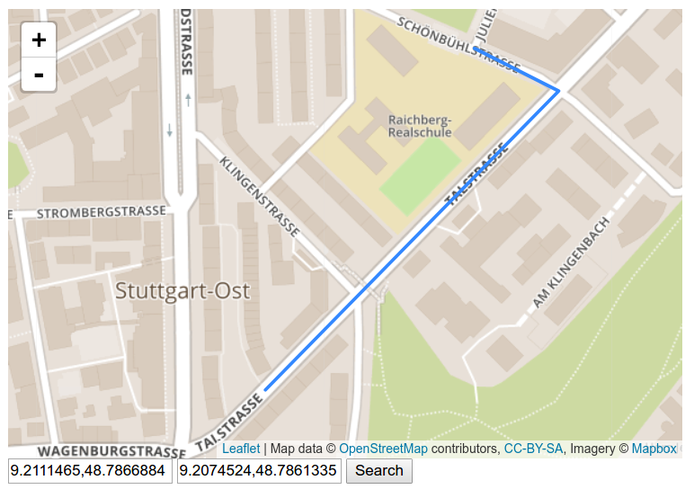

# routine

[](https://travis-ci.org/OrKoN/routine)

A routing engine based on OSM data written in JavaScript (not there yet). 



## Berlin OSM PBF import

```
INFO: Memory used 24.8 MB
INFO: Graph size 141 kB
INFO: Nodes in graph 1982
INFO: Edges in graph 5364

Time

real  0m22.430s
user  0m23.132s
sys 0m0.664s
```