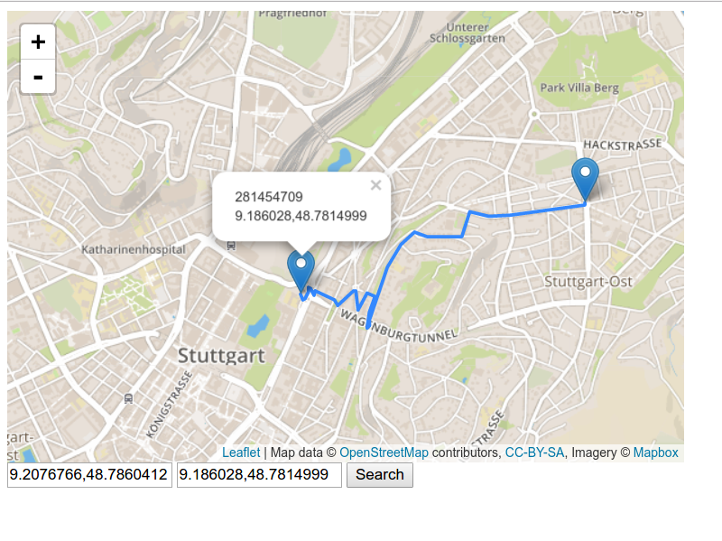

# routine

[](https://travis-ci.org/OrKoN/routine)

A routing engine based on OSM data that is completely written in JavaScript and relying on quite many native modules. The status is: *completely experimental* and has a *minimal feature set* to demonstrate the approach.



## Architecture

Routing consists of an HTTP server to power the API and a farm of background workers running in separate processes. The workers are created via `fork` and, therefore, are able to share the memory where the graph is stored. The graph is stored in files and loaded into the workers in read-only mode via `mmap`.

## Performance

### Berlin OSM PBF import

```
INFO: Memory used 217 MB
INFO: Graph size 7.67 MB
INFO: Nodes in graph 77893
INFO: Edges in graph 274629
OK: Graph is created

real  0m22.475s
user  0m23.176s
sys 0m0.656s
```

### Stuttgart OSM BPF import

```
INFO: Memory used 883 MB
INFO: Graph size 37.5 MB
INFO: Nodes in graph 384299
INFO: Edges in graph 1337166
OK: Graph is created

real  1m5.906s
user  1m7.532s
sys 0m2.412s
```

Requests inside a city:

```
ab -n 1000 -c 7 "http://localhost:3000/directions?origin=9.2153206,48.7862428&destination=9.1532395,48.776464" 
This is ApacheBench, Version 2.3 <$Revision: 1706008 $>
Copyright 1996 Adam Twiss, Zeus Technology Ltd, http://www.zeustech.net/
Licensed to The Apache Software Foundation, http://www.apache.org/

Benchmarking localhost (be patient)
Completed 100 requests
Completed 200 requests
Completed 300 requests
Completed 400 requests
Completed 500 requests
Completed 600 requests
Completed 700 requests
Completed 800 requests
Completed 900 requests
Completed 1000 requests
Finished 1000 requests


Server Software:        
Server Hostname:        localhost
Server Port:            3000

Document Path:          /directions?origin=9.2153206,48.7862428&destination=9.1532395,48.776464
Document Length:        1762 bytes

Concurrency Level:      7
Time taken for tests:   2.087 seconds
Complete requests:      1000
Failed requests:        0
Total transferred:      1900000 bytes
HTML transferred:       1762000 bytes
Requests per second:    479.12 [#/sec] (mean)
Time per request:       14.610 [ms] (mean)
Time per request:       2.087 [ms] (mean, across all concurrent requests)
Transfer rate:          888.99 [Kbytes/sec] received

Connection Times (ms)
              min  mean[+/-sd] median   max
Connect:        0    0   0.0      0       0
Processing:     4   14  14.1     10     124
Waiting:        4   14  14.1     10     124
Total:          4   14  14.1     10     124

Percentage of the requests served within a certain time (ms)
  50%     10
  66%     13
  75%     15
  80%     17
  90%     23
  95%     41
  98%     67
  99%     91
 100%    124 (longest request)
```
